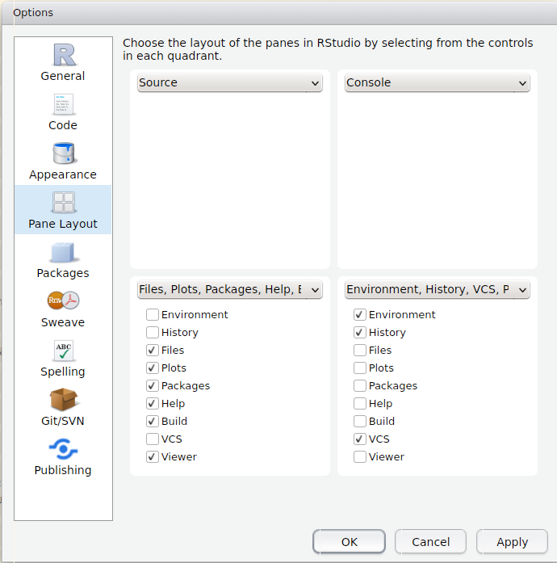
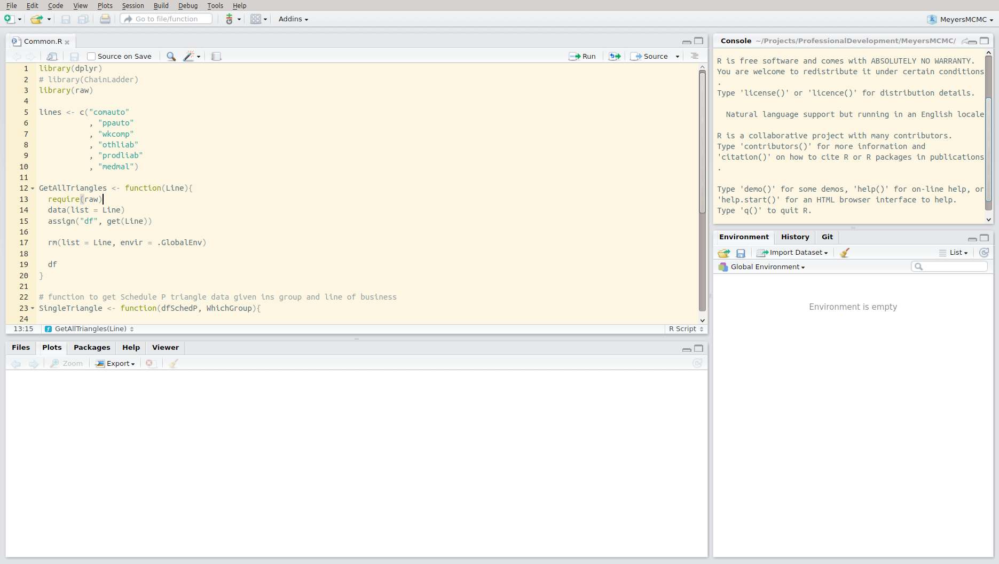
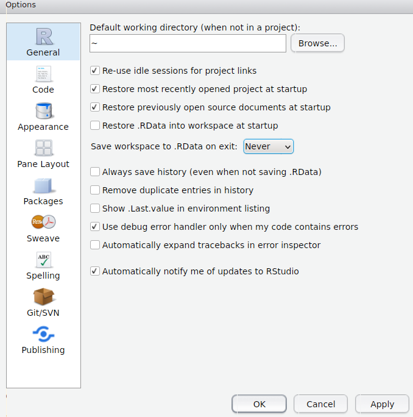
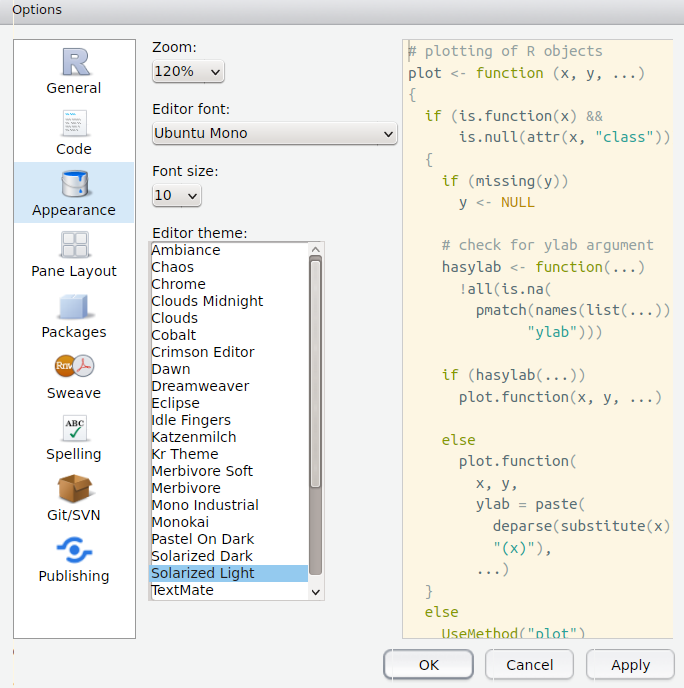

##  {.flexbox .vcenter}

> "Relax and embrace the chaos that is R."

Patrick Burns
  
[www.burns-stat.com/pages/Present/infernoishR_annotated.pdf](www.burns-stat.com/pages/Present/infernoishR_annotated.pdf)

## Goals for session one

* Make sure that R and RStudio are installed
* Get used to the RStudio environment
* Create a script
    * Simulate normal random variable
    * Construct a new variable
    * Construct a data frame
    * Fit a linear model
    * Plot
* Install a package

## Installation {.flexbox .vcenter}

Raise your hand if you need help installing

## RStudio

* Edit scripts
* View multiple scripts at once
* Step through code
* Nice debugger
* Loads of help building packages

## Options



## 

This is my preferred layout.




## 

<div class="columns-2">

General options



Appearance



</div>

## Help

Use it early and often.

```{r eval=FALSE}
?lm
??cluster
```

If you don't, expect to get familiar with this abbreviation: [RTFM](https://en.wikipedia.org/wiki/RTFM)

## Excel and R

|             | Excel            |                                   R  |
|-------------|------------------------------|--------------------------|
| File format | .xlsx                                     |                           .R/.Rmd/.Rnw |
| Data        | Stored in the file, or available via .odc | _Always_ read in externally or constructed programatically |
| Extensions  | .xlam                                     | Packages   |

## Editing a script

```{r eval=FALSE, echo=TRUE}
N <- 100
B0 <- 5
B1 <- 1.5

set.seed(1234)
e <- rnorm(N, mean = 0, sd = 1)
X <- rep(seq(1, 10), 10)

Y <- B0 + B1 * X + e

plot(X, Y)

myFit <- lm(Y ~ X)
```

## Task

1. Run the script
2. Save it
1. Close down RStudio
2. Open it up again
3. Find your script
4. Run it
5. Change the script so that you produce 10,000 observations
7. Make the errors heteroskedastic
8. Make the response term, Y, lognormal
6. Run that script

## Packages

* Allows any user to extend R's capabilities
* Must conform to a well-defined standard
* Easy to install and update
* Open source means users may test and improve the code
* Can access C or FORTRAN run-time libraries to improve performance

## Installation and loading

Installing something new

```{r eval=FALSE}
install.packages("ggplot2")
```

Loading an installed package

```{r eval=FALSE}
library(MRMR)
```

## Unloading and/or removing installed package

Unloading

```{r eval=FALSE}
detach("package:MRMR", unload = TRUE)
```

Removing

```{r eval=FALSE}
remove.packages("IdontWantThisAnymore")
```

## Don't make this complicated

|              |                                |
|--------------|---------------------------------|
| Installation | Copying a file to your computer |
| `library` | Opening a file = Placing a file into RAM |
| Detaching a package | Closing a file |
| Removing a package | Deleting a file |

## Don't make this complicated

>- _A package won't work if it isn't loaded with `library`._
>- _You can't load a package if you haven't installed it._
>- _You don't need to install a package more than once._
>- _Turning off your computer or shutting down R won't remove a package._
>- _Unloading a package doesn't delete it._

## Exercise

Install the `actuar` package.

## A couple final thoughts

* Try not to work in the console. Write code in scripts.
* .Rdata and History look like they might be helpful. They're not. Stick to scripts.
